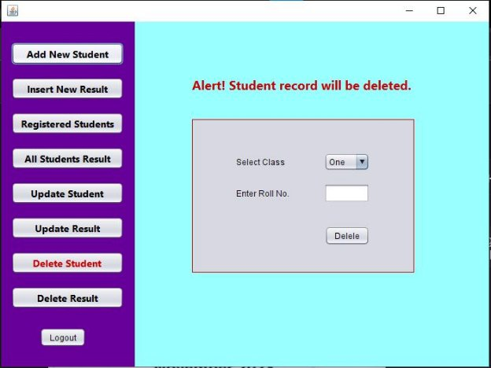

**Acknowledgment** 

We would like to express our thanks and gratitude to **Md. Fazle Rabbi**, Professor, Department of Computer  Science  and  Engineering  who  gave  us  a  golden  opportunity  to  do  the  **“Result Management System”** project and provided support in completing our project. His heartiest & kind Co-operation during our project work makes the dream real & we succeed to complete our project.  

While we were preparing this project file, various information that we found helped us in the chapter of profile adding and we are glad that we were able to complete this project and understand many things. The preparation of the project was an immense learning experience and we included many personal qualities during this process like responsibility, punctuality, confidence and others.  

We would like to thank our supervisor who supported us all the time, cleared our doubts and to our parents who also played a big role in finalisation of our project file. We are taking this opportunity to acknowledge their support and we hope that they keep supporting us like this in the future.  

A project is a bridge between theoretical and practical learning and with this thinking we worked on the project and made it successful due to timely support and efforts of all who helped us.  

Once again, we would like to thank our classmates and friends also for their encouragement and help in designing and making our project creative. We are in debt to all these. Only because of them we were able to create our project and make it a good and enjoyable experience. 

**Abstract**

The  Result  Management  System  is  a  robust  desktop  application  designed  to  streamline  the management of academic performance records within a school environment. In an era where effective organization of student results is paramount, this offline software offers comprehensive features tailored to meet the needs of educators and administrators. 

Key functionalities of the Result Management System include an intuitive admin panel that enables administrators to efficiently manage student profiles and academic results. Through the admin panel, administrators  can  easily  add  new  student  profiles,  input  academic  results,  and  update  student information as required. The system maintains a centralized database of all student results, ensuring easy access and retrieval. 

For students, the system provides a user-friendly interface to view their academic results by entering their class and roll number. Additionally, a print functionality allows students to generate hard copies of their result summaries for reference purposes, promoting accessibility and convenience. 

The Result Management System operates as an offline desktop application, offering reliability and data security for school administrators. By providing stakeholders with timely access to accurate performance  data,  the  system  contributes  to  informed  decision-making  and  supports  efforts  to enhance educational outcomes within the school community. 

Contents 

[**Chapter 01 – Introduction  ............................................................................................................................. 6** ](#_page5_x54.00_y57.68)

1. [Introduction: ............................................................................................................................................ 6 ](#_page5_x54.00_y121.68)
1. [Objective of the project: .......................................................................................................................... 6 ](#_page5_x54.00_y294.68)
1. [Project Scope: .......................................................................................................................................... 6 ](#_page5_x54.00_y472.68)
1. [Significance of the Result Management System: .................................................................................... 6 ](#_page5_x54.00_y601.68)

[**Chapter 02 – Overview  .................................................................................................................................. 7** ](#_page6_x54.00_y57.68)

[2.1 Overview: ................................................................................................................................................ 7 ](#_page6_x54.00_y123.68)

[**Chapter 3 - Proposed Methodology  .............................................................................................................. 8** ](#_page7_x54.00_y57.68)

1. [Introduction ............................................................................................................................................. 8 ](#_page7_x54.00_y121.68)
1. [Requirement Phase .................................................................................................................................. 8 ](#_page7_x54.00_y331.68)
1. [System Design Phase............................................................................................................................... 9 ](#_page8_x54.00_y79.68)
1. [Implementation Phase ........................................................................................................................... 10 ](#_page9_x54.00_y517.68)
1. [System Testing Phase ............................................................................................................................ 11 ](#_page10_x54.00_y77.68)
5. [Deployment Phase ................................................................................................................................. 11 ](#_page10_x54.00_y229.68)

   6. [User Training and Feedback:................................................................................................................ 11 ](#_page10_x54.00_y471.68)
6. [Maintenance Phase ................................................................................................................................ 12 ](#_page11_x54.00_y57.68)

[**Chapter 4 - Result and discussion ................................................................................................................ 13** ](#_page12_x54.00_y57.68)[Chapter 05 – Conclusion  .............................................................................................................................. 26** ](#_page25_x54.00_y57.68)

1. [Conclusion: ............................................................................................................................................ 26 ](#_page25_x54.00_y128.68)
1. [Limitations: ........................................................................................................................................... 26 ](#_page25_x54.00_y522.68)
1. [Future Work .......................................................................................................................................... 26 ](#_page25_x54.00_y629.68)

5 
**Chapter 8** 

**Introduction** 

1. **Introduction:** 

In today's dynamic educational landscape, effective management of academic results has  emerged as a critical necessity. The Result Management System steps in as a robust solution tailored to   address  the  complexities  associated  with  organizing  and  overseeing  student  performance  data   within educational institutions. This introduction offers an insight into the project, highlighting its pivotal  role  in  optimizing  academic  operations  and  enriching  the  educational  journey  for  all  stakeholders. 

2. **Objective of the project:** 

The  Result  Management  System  sets  out  to  achieve  several  key  objectives  upon  completion,   including: 

- Providing administrators with a user-friendly interface to efficiently manage student data and academic results. 
- Facilitating seamless tracking of academic progress and student profile. 
- Enhancing accessibility to academic records for both administrators and students. 
3. **Project Scope:** 

The Result Management System encompasses a comprehensive array of features and functionalities, ranging from result entry and management to student profile maintenance and report generation. It serves as a centralized platform for educational institutions to effectively monitor and analyze student performance, ensuring timely interventions and informed decision-making. 

4. **Significance of the Result Management System:** 

The  Result  Management  System  transcends  mere  technological  innovation;  it  signifies  a transformative shift in academic management practices. By automating tedious tasks and streamlining data management processes, the system empowers educators to focus on delivering quality education while enabling students to track their academic journey with ease. 

As the Result Management System unfolds, it stands poised to revolutionize academic management, offering a holistic and efficient solution to meet the evolving needs of educational institutions. 

**Overview** 

**2.1 Overview:**  

The  Result  Management  System  represents  a  pivotal  advancement  in  educational  technology, providing educational institutions with a comprehensive solution for efficiently managing academic results. This powerful software platform streamlines the entire process of result management, from data entry to analysis, enabling administrators to effectively track student performance and ensure accurate record-keeping. With its intuitive interface and robust functionality, the Result Management System revolutionizes the way academic results are handled, enhancing transparency, efficiency, and overall productivity within educational institutions. 

**Key Features:** 

- **Add New Student:** Easily add new student profiles with relevant details such as Class, Section, Roll number, Name, Gender,Father’s name . 
- **Insert New Result:** Seamlessly input new academic results for students in subject wise. 
- **Registered Students:** View a comprehensive list of all registered students, along with their basic information. 
- **All Student Result:** Access a centralized database of all student results, organized for easy retrieval and analysis. 
- **Update Student:** Edit existing student information, such as Class, Section, Roll number, Name, Gender,Father’s name. 
- **Update Result:** Make modifications to previously entered results, ensuring accuracy and completeness. 
- **Delete Student:** Remove student profiles from the system when necessary, maintaining data integrity and security. 
- **Delete Result:** Delete specific result entries as needed, with appropriate permissions and 

  safeguards in place. 

- **Result Viewing:** Students can access their academic results by entering their class and roll number.    
- **Print Functionality:** The system allows students to print their result summaries for reference or documentation purposes, enhancing accessibility and convenience. 

**Proposed Methodology**

1. **Introduction** 

Methodology is like a roadmap for getting things done and finding useful information. It's about how we go about accessing, building, testing, and evaluating data using different methods. In this chapter, we'll talk about the steps we're taking to finish our project and create its prototype. A project is like a temporary job that aims to make something unique within a set timeframe and budget. It could be a new product, service, or just achieving specific goals. Managing projects means using different skills and strategies to get things done efficiently. The biggest challenge is meeting all the project goals while working within the given limits. We usually outline all this information in project documents we make at the start. 

Typically, we document all these details right at the beginning of the project for clarity and reference. 

2. **Requirement Phase** 
1. **Engaging Stakeholders:** 
- Recognize the important people involved, such as school administrators, teachers, and students. 
- Understand what they need and what they expect from the result management system. 
2. **Functional Needs:** 
- Organising results, inserting new students, search by class and roll. 
- Offering options for update and delete, ensuring the system can grow as needed. 
3. **Non-Functional Aspects:** 
- Ensuring the system runs smoothly, is dependable, easy to use, secure, and works with different devices. 
- Providing detailed documents outlining how the system will be used, stories from users, and specifications. 
4. **Review and Approval:** 
- Regularly meeting with mentors to discuss progress and gather feedback. 
- Getting formal approval before moving on to the design phase. 

8 

3. **System Design Phase** 

Blueprint that outlines how the "School Result Management" system will function and how its components will interact, ensuring a seamless and effective platform for managing academic results. 

**System Design:**  

9 

**Architecture Design:**  

4. **Implementation Phase** 
1. **Coding:** 
- Writing code based on the system design using Java JFrame. 
- Adhering  to  coding  standards  and  best  practices  while  collaborating  with  the development team. 
- Utilising IDEs like Netbeans and integrating version control with GitHub. 
2. **Database Implementation:** 
- Implementing the designed database schema using MySQL. 
- Setting up tables, relationships, and indexes to store result data efficiently. 
- Integrating the database seamlessly with the Java application code. 
3. **Functionality Development:** 
- Developing core functionalities such as result management, student registering,insert result within the Java JFrame framework. 
- Enabling features for updating student,student result,delete wrong info etc. 
- Coordinating  code  versioning  and  collaboration  using  GitHub  for  streamlined development processes. 
5. **System Testing Phase** 

During  this  stage,  software  undergoes  rigorous  testing  before  integration  into  actual  business operations. Testing mimics real-world scenarios, assessing both data and processes for accuracy and functionality. Identifying and resolving bugs or errors is paramount, ensuring the software is error- free and aligns with user requirements prior to deployment.

5. **Deployment Phase** 

The  Deployment  Phase  involves  preparing  the  software  for  installation  on  target  systems  and providing necessary documentation for seamless setup and usage. It includes ensuring compatibility, conducting testing in the deployment environment, and executing the deployment process efficiently. The goal is to transition the software from development to production while minimising downtime and  disruptions,  ensuring  that  it  functions  flawlessly  and  meets  user  requirements  in  the  live environment.

- Prepare the application for deployment on target systems. 
- Provide necessary documentation for installation and usage. 

**3.6. User Training and Feedback:** 

Establishing a feedback mechanism is crucial for soliciting user input and insights regarding their experiences with the Result Management. This can be facilitated through surveys, focus groups, or dedicated  feedback  channels  where  users  can  submit  their  suggestions,  concerns,  and recommendations for potential enhancements and improvements. 

Analysing user feedback enables continuous improvement of the Result Management, ensuring that it remains responsive to user needs and evolving requirements. Regularly engaging with users and incorporating their input into the development roadmap fosters a collaborative and user-centric approach to system refinement and optimization. 

6. **Maintenance Phase** 

Establishing a system for ongoing maintenance and updates is essential to ensure the continued functionality and relevance of the Result Management. This phase involves several key activities aimed at proactively managing and optimising the system over time. 

A robust system for identifying, prioritising, and resolving issues is critical for maintaining the integrity and usability of the Result Management. Monitoring system performance and user feedback can also help identify emerging issues and prioritise resolution efforts effectively. 

The Maintenance Phase presents opportunities for ongoing enhancement and optimization of the Result  Management.  Collecting  and  analysing  user  feedback,  monitoring  industry  trends,  and conducting regular assessments of system performance can inform the prioritisation of new features and  improvements.  Adopting  iterative  development  methodologies  and  iterative  release  cycles facilitates  the  incorporation  of  user-driven  enhancements  and  ensures  the  Result  Management remains aligned with evolving user needs and technological advancements. 

By establishing a systematic approach to maintenance and updates, the Result Management can adapt to changing requirements, mitigate risks, and sustain its value as a reliable and effective tool for academic management and support. 

**Chapter 4**

**Result and discussion**

**“First Page”**

**“Admin Login”**

**“Add New Student”**

**“Insert New Result”**

**“Registered Student”** 

**“All Student Result”** 

**“Update Student”** 

**“Update Result”** 

**“Delete Student”** 

**“Delete Result”** 

**“Student”           “Choose Class & Roll”**

**“Progress Report”** 

**“Print Report”** 

**Chapter 05** 

**Conclusion** 

1. **Conclusion:** 

In conclusion, the **Result Management Project** stands as a testament to the integration of cutting- edge technology and user-centric design principles. Leveraging Java, JavaSwing and MySQL, this software provides a comprehensive solution for educational institutions grappling with the intricacies of academic result management. 

By  placing  user  needs  at  the  forefront,  the  project  ensures  a  seamless  experience  for  both administrators and students alike. The intuitive interface, coupled with robust backend functionality, reflects a dedication to simplicity and efficiency in handling student data and academic records. 

As we embark on the deployment phase, we are confident that the Result Management Project will not only meet but surpass user expectations. Continuous feedback mechanisms and a steadfast commitment to ongoing maintenance guarantee that this software remains a dependable ally for educational institutions seeking to streamline their academic operations. 

The  Result  Management  Project  represents  a  harmonious  fusion  of  technology  and  education, simplifying  complex  tasks  to  empower  administrators  and  students  alike.  With  the  invaluable guidance of our mentor, **Md Fazle Rabbi sir**, we overcame numerous challenges, acquiring new skills  and knowledge along the way. Moving forward, we remain committed to enhancing  the functionality  of  the  Result  Management  System  to  meet  the  evolving  needs  of  educational institutions. 

2. **Limitations:**  
- Limited Offline Functionality 
- Resource Intensive 
- Technology Dependency 
3. **Future Work**  
1. AI Integration for Personalization 
1. Blockchain for Academic Records 
1. Mobile App Feature Expansion 
1. Web App Feature Expansion 

**References** 

1. Cay S. Horstmann, Core Java Volume I – Fundamentals (11th Edition). 
1. Brian Goetz with Tim Peierls, Joshua Bloch, Joseph Bowbeer, David  

Holmes, and Doug Lea Java Concurrency in Practice (1st Edition). 

3. Scott Oaks, Java Performance: The Definite Guide (1st Edition). 
3. Brett D. McLaughlin, Gary Pollice & David West, Head First ObjectOriented Analysis Design (1st Edition).  
3. Hamzan Wadi, Step By Step Java GUI With JDBC & MySQL 

(3rd Edition). 
26 
